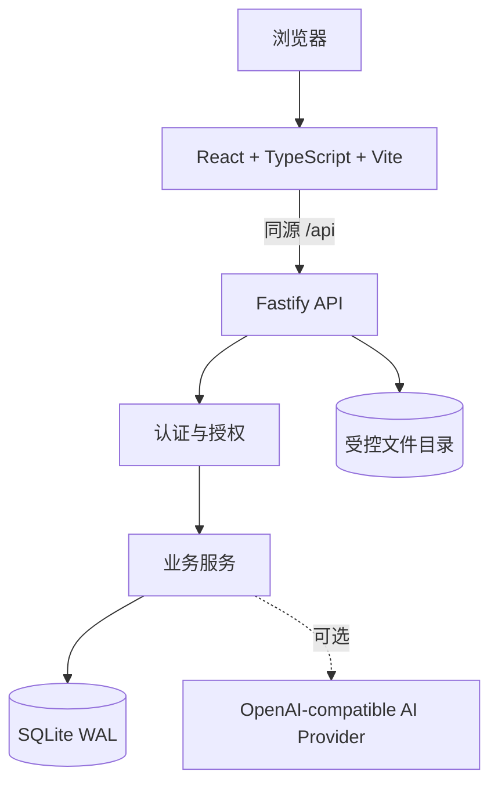
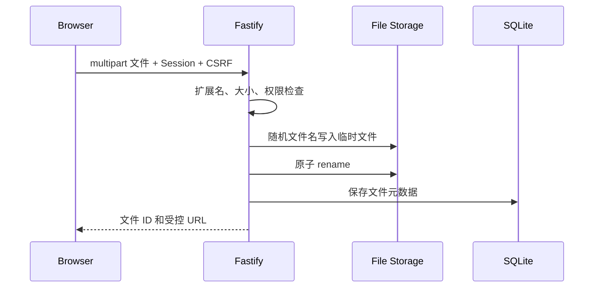

# InteSchool 技术架构

## 1. 总体架构



应用采用单体全栈部署。Fastify 同时提供 API 和生产前端静态文件，避免跨域 Cookie 与 CSRF 配置复杂化。

## 2. 前端职责

前端位于 `src/`，职责限定为：

- 页面渲染、表单交互和路由
- Zustand 会话视图状态与界面偏好
- 调用同源 API
- 显示服务端返回的授权结果

前端不负责：

- 密码校验和存储
- 业务数据库持久化
- 学校/教师/资源权限判定
- 原始文件落盘与二进制解析
- AI 密钥保存

`src/services/` 是类型兼容的 API 客户端，不再包含业务数据库实现。

## 3. 后端职责

后端位于 `server/`：

```text
server/
├── app.ts                 # Fastify 组装、安全中间件、静态站点
├── config.ts              # 环境变量配置
├── database.ts            # SQLite schema、迁移、会话和文件元数据
├── rpc.ts                 # 显式服务注册、会话/学校/资源授权
├── domain/                # 题库、试卷、讲义、班级等业务服务
├── routes/
│   ├── auth.ts            # 注册、登录、学校审核、身份切换
│   └── files.ts           # 上传、下载、文本提取、文档导入
├── lib/
│   ├── password.ts        # scrypt 密码哈希
│   ├── document-extractor.ts
│   └── ai-provider.ts
└── seed-state.json        # 开发演示种子，生产默认不加载
```

业务服务通过请求级 `AsyncLocalStorage` 获取状态快照。每次业务写操作在服务端串行执行，比较操作前后集合并以事务写回 SQLite，避免浏览器直接提交整库快照。

## 4. 数据库

SQLite 启用：

- WAL 日志模式
- 外键约束
- 5 秒 busy timeout
- 按集合、学校和所有者建立索引

主要表：

| 表 | 用途 |
| --- | --- |
| `app_records` | 业务实体，包含 collection、学校、所有者和 JSON 数据 |
| `users` | 登录账号、教师关联和密码哈希 |
| `sessions` | 会话令牌哈希、CSRF 令牌和过期时间 |
| `files` | 文件所有者、学校、MIME、大小和随机存储名 |
| `metadata` | schema 版本等元数据 |

账号凭据与教师业务资料分表。业务 API 返回教师对象时会剥离密码、第三方标识和其他敏感字段。

SQLite 适合单实例部署。当前架构不支持多个容器共享同一 SQLite 数据卷。

## 5. 认证与授权

### 5.1 密码

- 注册和改密要求至少 10 位。
- bootstrap 管理员密码要求至少 12 位。
- 使用 `scrypt`、随机 16 字节盐和恒定时间比较。
- 数据库不保存明文密码。

### 5.2 会话

- 浏览器接收随机 256 位会话令牌。
- Cookie 使用 `HttpOnly`、`SameSite=Lax`；HTTPS 部署增加 `Secure`。
- 数据库仅保存 SHA-256 会话令牌哈希。
- 修改请求需携带独立 CSRF 令牌。
- 登录接口有独立速率限制。

### 5.3 权限

RPC 只允许 `service-registry.ts` 显式注册的方法。每次请求会校验：

1. 是否允许匿名调用；
2. 会话对应教师是否存在；
3. 当前所属学校是否匹配；
4. 参数中的教师 ID 是否为当前教师；
5. 目标资源是否属于当前教师、当前学校或允许共享；
6. 管理操作是否具有学校管理员或平台管理员角色。

管理员可以维护校级设置和组织成员，但不能冒充其他教师创建个人资源。

## 6. 文件处理

上传流程：



支持服务端文本提取：

- DOCX：Mammoth
- PDF：pdf-parse
- Markdown / TXT：UTF-8 读取

DOCX HTML 经过白名单净化。文件下载、预览和提取均需登录且满足所有者或同校权限。

## 7. 文档导入与识别

文档导入不再生成固定示例：

1. 原始文件上传到服务端；
2. 服务端提取实际文本；
3. 根据标题和段落生成 `DocumentRecord.sections`；
4. 识别服务从真实 section 内容提取题干、选项和题型；
5. 教师确认后由后端写入题库。

内建识别提供可离线工作的规则提取。AI 内容生成使用可选的 OpenAI-compatible 服务，密钥仅存在于后端环境变量。

## 8. 生产部署

Docker 镜像采用：

- Node.js 22 Debian slim
- 多阶段构建
- `npm prune --omit=dev`
- 非 root `node` 用户
- `dumb-init` 处理信号
- `/api/health` 健康检查
- `/app/data` 持久化卷

生产默认空库。首次启动由 bootstrap 环境变量创建首个学校和平台管理员。开发模式可显式加载 `seed-state.json`。

## 9. CI 与发布

CI 执行：

1. `npm ci`
2. ESLint
3. 前后端 TypeScript 检查
4. Vitest 与覆盖率门禁
5. 前后端生产构建
6. Docker 镜像构建

Release workflow 在 `v*` tag 上：

- 再次运行完整质量门禁
- 构建 `linux/amd64` 和 `linux/arm64`
- 生成 provenance 和 SBOM
- 推送 GHCR
- 创建 GitHub Release
