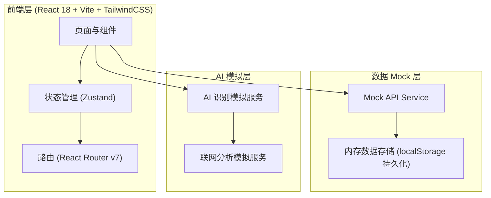
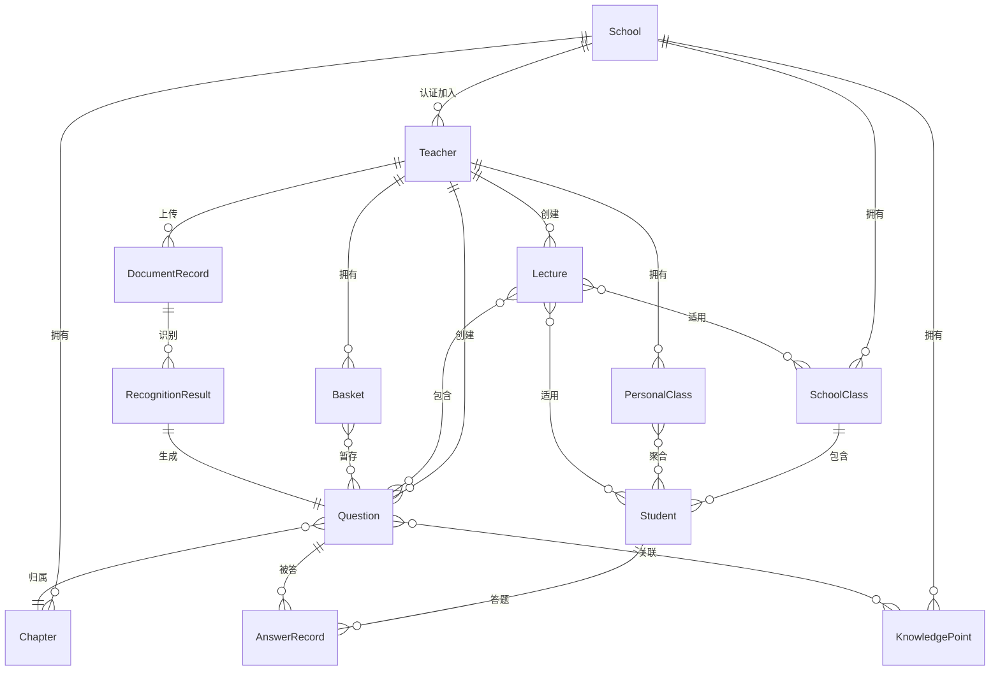

# 智题云校技术架构文档

> 文档状态：前端原型架构。具体依赖版本、脚本与质量门禁以 `package.json`、`README.md` 和 CI 配置为准。

## 1. 架构设计



> 说明：本项目为前端演示实现，所有 AI 识别、联网分析、数据库均通过 Mock 服务模拟。架构预留后端接入位置，后续可替换为真实 API。

## 2. 技术说明

- **前端**：React@18 + tailwindcss@3 + vite
- **初始化工具**：vite-init (react-ts 模板)
- **状态管理**：Zustand (轻量、TypeScript 友好)
- **路由**：React Router v7
- **图标**：lucide-react
- **拖拽排序**：@dnd-kit/core + @dnd-kit/sortable (讲义大纲拖拽)
- **富文本/Markdown**：react-markdown + remark-gfm
- **后端**：无 (Mock 数据，localStorage 持久化)
- **数据库**：浏览器 localStorage 模拟，提供 seed 数据初始化

## 3. 路由定义

| 路由 | 用途 |
|------|------|
| /login | 登录注册页 |
| /school-auth | 学校认证加入页 |
| /dashboard | 工作台首页 |
| /question-bank | 题库管理列表 |
| /question-bank/:id | 题目详情 |
| /import | 文档导入与 AI 识别 |
| /lectures | 讲义库管理列表 |
| /lectures/new | 讲义编辑器(新建) |
| /lectures/:id/edit | 讲义编辑器(编辑) |
| /knowledge-tree | 知识树浏览器 |
| /classes | 班级与学生管理 |
| /classes/:id | 班级详情与学生列表 |
| /baskets | 试题篮列表 |
| /baskets/:id | 试题篮详情 |
| /analytics | 学生使用分析 |

## 4. API 定义 (Mock Service)

```typescript
// 认证相关
interface AuthAPI {
  register(email: string, password: string, name: string): Promise<Teacher>
  login(email: string, password: string): Promise<Teacher>
  applySchool(teacherId: string, schoolId: string, proof: ProofFile): Promise<Application>
}

// 学校相关
interface SchoolAPI {
  searchSchools(keyword: string): Promise<School[]>
  getSchool(schoolId: string): Promise<School>
}

// 题库相关
interface QuestionBankAPI {
  listQuestions(filter: QuestionFilter): Promise<Question[]>
  getQuestion(id: string): Promise<Question>
  createQuestion(input: QuestionInput): Promise<Question>
  updateQuestion(id: string, patch: Partial<Question>): Promise<Question>
  deleteQuestion(id: string): Promise<void>
  batchImport(questions: QuestionInput[]): Promise<Question[]>
}

// 文档导入与 AI
interface ImportAPI {
  uploadDocument(file: File): Promise<DocumentRecord>
  getDocumentStructure(docId: string): Promise<DocumentSection[]>
  aiRecognize(docId: string): Promise<RecognitionResult[]>
  webAnalyze(questionText: string): Promise<WebAnnotationStats>
  confirmRecognition(recognitionId: string, confirmed: boolean): Promise<void>
}

// 讲义相关
interface LectureAPI {
  listLectures(filter: LectureFilter): Promise<Lecture[]>
  getLecture(id: string): Promise<Lecture>
  createLecture(input: LectureInput): Promise<Lecture>
  updateLecture(id: string, patch: Partial<Lecture>): Promise<Lecture>
  addQuestionToLecture(lectureId: string, questionId: string, position: number): Promise<void>
  generateKnowledgePoint(topic: string, context?: string): Promise<string>
}

// 试题篮
interface BasketAPI {
  listBaskets(): Promise<Basket[]>
  createBasket(name: string): Promise<Basket>
  addQuestion(basketId: string, questionId: string): Promise<void>
  removeQuestion(basketId: string, questionId: string): Promise<void>
  generateLectureFromBasket(basketId: string): Promise<Lecture>
}

// 班级学生
interface ClassAPI {
  listSchoolClasses(schoolId: string): Promise<SchoolClass[]>
  listPersonalClasses(teacherId: string): Promise<PersonalClass[]>
  createClass(input: ClassInput): Promise<SchoolClass | PersonalClass>
  addStudent(classId: string, student: StudentInput): Promise<Student>
  batchImportStudents(classId: string, students: StudentInput[]): Promise<void>
}

// 知识树
interface KnowledgeTreeAPI {
  getChapterTree(schoolId: string): Promise<TreeNode>
  getKnowledgeTree(schoolId: string): Promise<TreeNode>
  addNode(parentId: string, node: TreeNodeInput): Promise<TreeNode>
}
```

## 5. 服务端架构

本项目为前端纯展示实现，无服务端。Mock Service 层封装于 `src/services/` 目录，模拟异步 API 行为。常规操作默认不会注入随机错误；测试特定异常路径时可显式传入错误率。

## 6. 数据模型

### 6.1 数据模型定义



### 6.2 数据定义 (TypeScript 类型)

```typescript
// 核心实体
interface Teacher {
  id: string
  email: string
  name: string
  schoolId: string | null
  subject: string
  status: 'pending' | 'active' | 'rejected'
  createdAt: string
}

interface School {
  id: string
  name: string
  code: string
  logo: string
  description: string
  teacherCount: number
  studentCount: number
}

interface SchoolClass {
  id: string
  schoolId: string
  name: string
  grade: string
  studentCount: number
  createdAt: string
}

interface PersonalClass {
  id: string
  teacherId: string
  name: string
  description: string
  studentIds: string[]
  createdAt: string
}

interface Student {
  id: string
  name: string
  studentNo: string
  classId: string
  schoolId: string
  grade: string
}

interface Chapter {
  id: string
  schoolId: string
  parentId: string | null
  name: string
  order: number
  level: number
}

interface KnowledgePoint {
  id: string
  schoolId: string
  parentId: string | null
  chapterId: string
  name: string
  order: number
  level: number
}

interface Question {
  id: string
  teacherId: string
  schoolId: string
  type: 'single' | 'multiple' | 'judge' | 'short' | 'essay'
  stem: string
  options?: string[]
  answer: string
  analysis: string
  chapterIds: string[]
  knowledgePointIds: string[]
  difficulty: 1 | 2 | 3 | 4 | 5
  recommendation: 1 | 2 | 3 | 4 | 5
  usageCount: number
  remark: string
  sourceDocId?: string
  isShared: boolean
  createdAt: string
  updatedAt: string
}

interface Lecture {
  id: string
  teacherId: string
  schoolId: string
  title: string
  chapterIds: string[]
  knowledgePointIds: string[]
  grade: string
  schoolYear: string
  classIds: string[]
  studentIds: string[]
  sections: LectureSection[]
  version: number
  status: 'draft' | 'published'
  createdAt: string
  updatedAt: string
}

interface LectureSection {
  id: string
  title: string
  type: 'chapter' | 'knowledge' | 'question' | 'text'
  content: string
  questionId?: string
  children: LectureSection[]
}

interface Basket {
  id: string
  teacherId: string
  name: string
  questionIds: string[]
  createdAt: string
  updatedAt: string
}

interface DocumentRecord {
  id: string
  teacherId: string
  fileName: string
  fileType: 'word' | 'pdf' | 'markdown'
  fileSize: number
  sections: DocumentSection[]
  status: 'uploaded' | 'recognizing' | 'recognized' | 'confirmed'
  createdAt: string
}

interface DocumentSection {
  id: string
  title: string
  content: string
  level: number
  children: DocumentSection[]
}

interface RecognitionResult {
  id: string
  documentId: string
  question: Omit<Question, 'id' | 'teacherId' | 'schoolId' | 'createdAt' | 'updatedAt'>
  confidence: number
  webAnnotations: WebAnnotationStats
  status: 'pending' | 'confirmed' | 'rejected'
}

interface WebAnnotationStats {
  totalSources: number
  topChapters: { chapter: string; count: number }[]
  topKnowledgePoints: { point: string; count: number }[]
}

interface AnswerRecord {
  id: string
  studentId: string
  questionId: string
  lectureId: string
  isCorrect: boolean
  answeredAt: string
}

interface TreeNode {
  id: string
  name: string
  type: 'chapter' | 'knowledge'
  count: number
  children: TreeNode[]
}
```

### 6.3 初始化种子数据

系统启动时通过 `src/services/seed.ts` 注入以下种子数据：

- 2 所示例学校（北京四中、上海实验中学）
- 每校 3-4 个示例教师与 5-8 个班级
- 高中数学/物理完整章节树（人教版）
- 50 道示例题目覆盖各难度与知识点
- 5 份示例讲义（草稿与已发布各若干）
- 3 个示例试题篮
- 1 份已上传文档与对应识别结果

## 7. 目录结构

```
src/
├── components/         # 通用组件
│   ├── layout/         # 布局组件 (侧栏、顶栏)
│   ├── ui/             # 基础 UI 组件 (Button, Card, Modal 等)
│   ├── tree/           # 知识树组件
│   └── question/       # 题目卡片组件
├── pages/              # 页面组件
│   ├── auth/
│   ├── dashboard/
│   ├── question-bank/
│   ├── import/
│   ├── lectures/
│   ├── knowledge-tree/
│   ├── classes/
│   ├── baskets/
│   └── analytics/
├── services/           # Mock API 服务
│   ├── auth.ts
│   ├── school.ts
│   ├── question.ts
│   ├── lecture.ts
│   ├── basket.ts
│   ├── class.ts
│   ├── knowledge.ts
│   ├── import.ts
│   ├── ai.ts
│   └── seed.ts
├── stores/             # Zustand 状态
│   ├── auth.ts
│   ├── school.ts
│   └── ui.ts
├── types/              # TypeScript 类型
│   └── index.ts
├── utils/              # 工具函数
├── App.tsx
├── main.tsx
└── index.css
```
